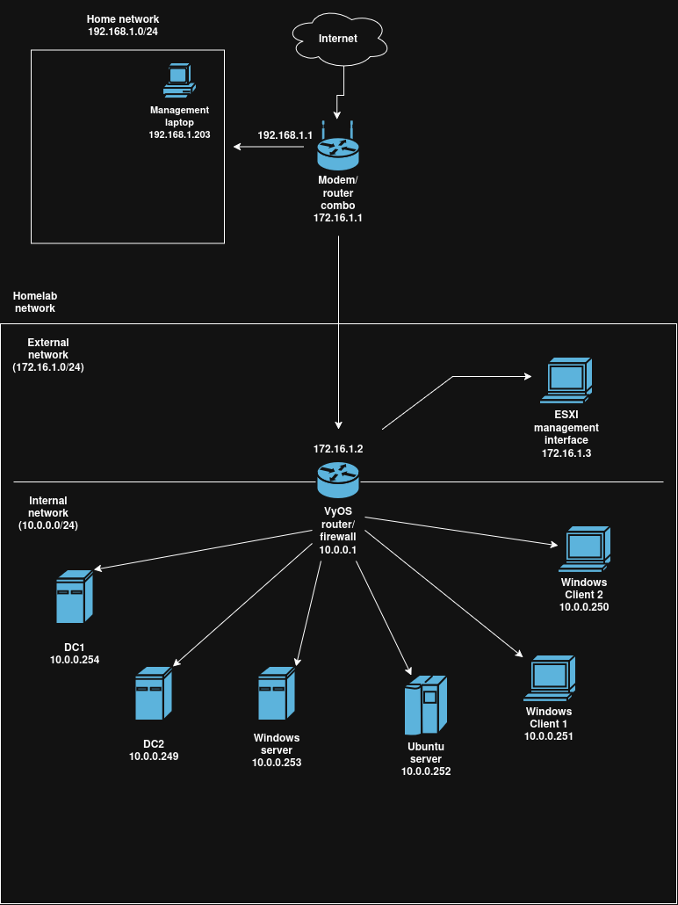

---
hide:
  - navigation   # hide the left sidebar on this page
  - toc          # hide the "on this page" list on the right
---

# Basic description

This site contains public documentation for my homelab, virtualized on a Dell server using VMWare ESXi. There's a "troubleshooting" section that contains writeups on issues found during lab setup and a "technologies" section describing various technologies that were added during the process.

## Lab layout

## Technologies

- [ESXi](technologies/esxi.md)
- [Active Directory](technologies/active-directory.md)

## Troubleshooting writeups

- [dns-not-resolving](troubleshooting/dns-not-resolving.md)